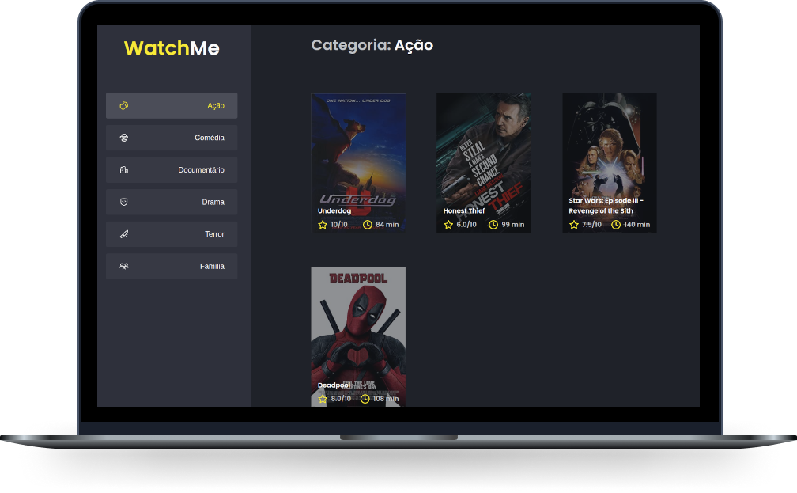

<p align="center">
  <h3 align="center">Watch Me</h3>
</p>

<p align="center">  
  <a href="#-projeto">Projeto</a>&nbsp;&nbsp;&nbsp;|&nbsp;&nbsp;&nbsp;  
  <a href="#-tecnologias">Tecnologias</a>&nbsp;&nbsp;&nbsp;|&nbsp;&nbsp;&nbsp;
  <a href="#-getting-started">Getting started</a>&nbsp;&nbsp;&nbsp;|&nbsp;&nbsp;&nbsp;  
  <a href="#-license">License</a>
</p>

<p align="center">

  <a href="#">
    
  </a>

  <a href="#">
    
  </a>

  <a href="#">
      
  </a>

  <a href="#">
    
  </a>

  <a href="./LICENSE">
    
  </a>

</p>

<p align="center">
    
</p>

<hr>


## 💻 Projeto

Nesse desafio, você deverá criar uma aplicação para treinar o que aprendeu até agora no ReactJS

Essa será uma aplicação onde o seu principal objetivo é refatorar uma página para listagem de filmes de acordo com gênero. 

A aplicação já está totalmente funcional mas grande parte do seu código está diretamente no arquivo `App.tsx`. Para resolver isso da melhor forma, é necessário dividir a aplicação em **pelo menos** duas partes principais: sidebar e o conteúdo principal que possui o header e a listagem de filmes.

- A aplicação possui apenas uma funcionalidade principal que é a listagem de filmes;
- Na sidebar é possível selecionar qual categoria de filmes deve ser listada;
- A primeira categoria da lista (que é "Ação") já deve começar como marcada;
- O header da aplicação possui apenas o nome da categoria selecionada que deve mudar dinamicamente.

A seguir veremos com mais detalhes o que e como precisa ser feito 🚀


## 🔖 Tecnologias

Esse projeto está utilizando as seguintes tecnologias

- [React](https://reactjs.org)
- [TypeScript](https://www.typescriptlang.org/)

## 🚀 Getting started

Clone the project

```bash
$ git clone https://github.com/nettoveloso/componentizando-aplicacao-react-ignite-rocketseat.git
```

Access the folder
```bash
$ cd componentizando-aplicacao-react-ignite-rocketseat
```

Follow the steps below
```bash
# Install the dependencies
$ yarn

# Start the server (backend)
$ yarn server

# Start the web (frontend)
$ yarn dev
```


## 📝 License

This project is licensed under the MIT License. See the [LICENSE](LICENSE) file for details.
